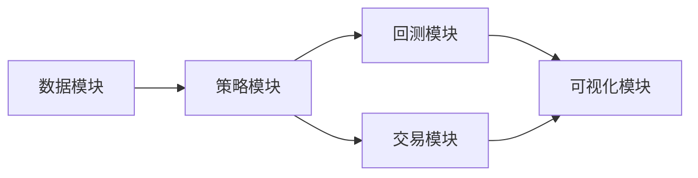

# 导言

这个项目的主要目的是：
1. 熟悉搭建量化交易系统的主要流程；
2. 验证一个简单的基于统计套利的交易策略的可行性。

交易的标的是BTC现货和U本位永续合约。

# **架构设计**



---
# **模块搭建**

## **数据模块**

- **数据源**：
  - Binance API
  - 第三方库：ccxt
- 实现功能：
  1. 下载数据；
  2. 缓存数据。
## **回测模块**

有很多现成的回测框架，如backtrader之类。这里自己写一个run_backtest函数。

实现功能：
1. 根据信号进行交易（做多信号：做多现货，做空合约；做空信号：做空现货，做多合约）；
2. 仓位管理，根据价差的zscore调整杠杆率;
3. 记录仓位；
4. 计算并输出指标：PnL、最大回撤、修复时间、夏普比率等。

回测结果案例（5m级k线， 2024-01-01-2025-01-01，不考虑手续费）：
```shell
初始资金: 10000
最终资金: 10651.176791099295
总收益: 651.1767910992949
年化收益率: 815.442016678132 %
胜率: 67.85714285714286 %
交易次数: 28
平均持仓时间: 0.7589285714285714 h
最大回撤: -1.9089572651408093 %
最大回撤修复时间: 125.5 h
夏普比率: 23.28055581414463
```

## **可视化模块**

使用matplotlib。模块化绘图函数。加入绘图函数**注册**机制，方便未来拓展。

---

可视化结果：
![[/img/plot_20250223_190651.png]]

# **进阶方向**

不一而足，方向很多：
1. 多因子模型开发；
2. 结合期权定价与波动率交易；
3. 基于强化学习的超参数优化。
